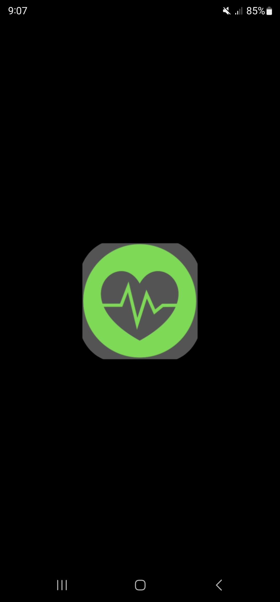
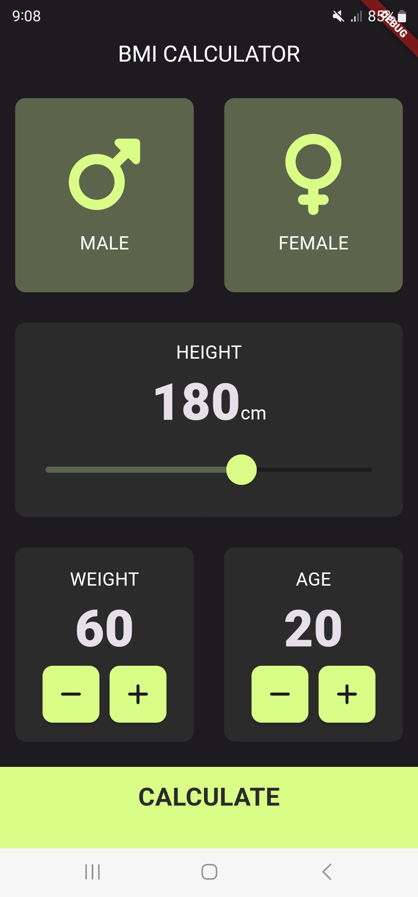
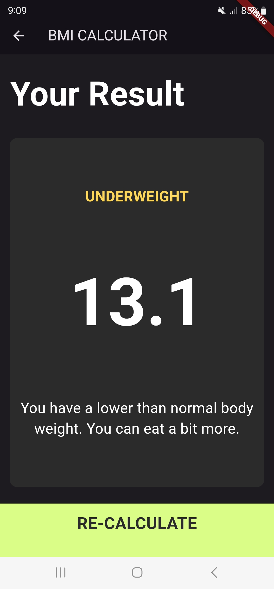
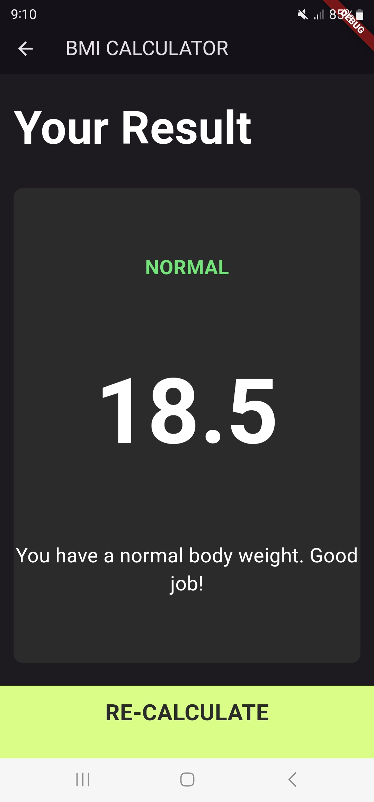
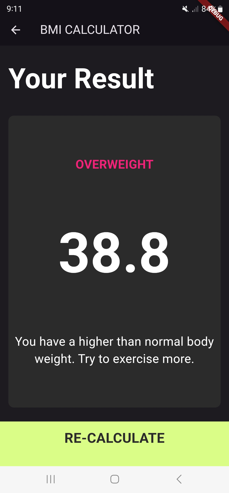

# *******BMI Calculator*******

## Overview
This project is a simple Body Mass Index (BMI) calculator built using Flutter. The app allows users to input their height and weight and calculates their BMI, providing a category based on their results (e.g., underweight, normal weight, overweight, or obese). The application is designed with a user-friendly interface that is responsive across a range of devices, adhering to Material Design guidelines.

## Screenshots

  
  
  
  
  

## Features

### User Inputs
- Input height in centimeters.
- Input weight in kilograms.

### BMI Calculation
- Computes BMI using the formula:
  \[
  BMI = \frac{{\text{weight in kg}}}{{(\text{height in meters})^2}}
  \]
- Displays the BMI score and its associated category:
  - Underweight
  - Normal weight
  - Overweight

### Result Page
- After entering height and weight, users are navigated to a results page displaying:
  - The calculated BMI score.
  - The BMI category (e.g., underweight, normal, overweight, obese).
  - Tips and suggestions based on the result.

### Custom Widgets
- Modular UI built with reusable Flutter widgets for easier maintenance.
- Custom cards for input and result display, using `reusable_card.dart`.
- Icon buttons for incrementing and decrementing values.

### Attractive UI
- Follows Material Design guidelines, offering a clean and modern interface.
- Smooth animations and transitions between screens for a better user experience.

## Project Structure

- **Main File (`main.dart`)**: The entry point of the application where the structure of the app is defined.
- **Input Page (`input_page.dart`)**: Handles the main input interface for height and weight.
- **Results Page (`results_page.dart`)**: Displays the BMI score and its corresponding category after calculation.

### Reusable Components:
- **`reusable_card.dart`**: Defines reusable card components used for displaying height, weight, etc.
- **`bottom_button.dart`**: Defines the custom button used for navigation and submission of inputs.
- **`roundregtangle_icon_button.dart`**: Custom buttons for incrementing or decrementing values.
- **`calc_brain.dart`**: Contains the logic for BMI calculation.
- **`icon_content.dart`**: Manages icon content for various parts of the application.
- **`constants.dart`**: Holds constants for styling and text used across the application.

## Installation

To run this project locally, follow the steps below:

1. Clone the repository from GitHub.
2. Open the project in your preferred IDE (Android Studio, VS Code).
3. Ensure that Flutter and Dart SDKs are installed and properly configured.
4. Run the following command in your terminal to fetch the dependencies.
5. Build and run the application using flutter run
6. The app should now be running on your connected device or emulator.

## Future Enhancements

- **Personalized Health Tips**: Provide personalized health suggestions based on the user’s BMI category, such as diet and exercise recommendations.
- **Multiple Measurement Units**: Allow users to switch between metric (kg/cm) and imperial (lbs/in) units for broader accessibility.
- **BMI History Tracking**: Add functionality to track and store BMI history over time for health monitoring.
- **Graphical Representation**: Implement graphs and charts to visually display BMI trends over weeks or months.
- **Health Insights**: Offer insights on health trends, such as weight gain/loss or stable BMI status over time.
- **Enhanced Accessibility**: Improve accessibility by adding features like voice assistance or high-contrast themes for readability.
- **Localization Support**: Include support for multiple languages to reach a wider audience.
- **Social Media Integration**: Enable users to share their BMI results on social media platforms directly from the app.

## Getting Started

This project is a starting point for a Flutter application.

A few resources to get you started if this is your first Flutter project:

- [Lab: Write your first Flutter app](https://docs.flutter.dev/get-started/codelab)
- [Cookbook: Useful Flutter samples](https://docs.flutter.dev/cookbook)

For help getting started with Flutter development, view the
[online documentation](https://docs.flutter.dev/), which offers tutorials,
samples, guidance on mobile development, and a full API reference.
